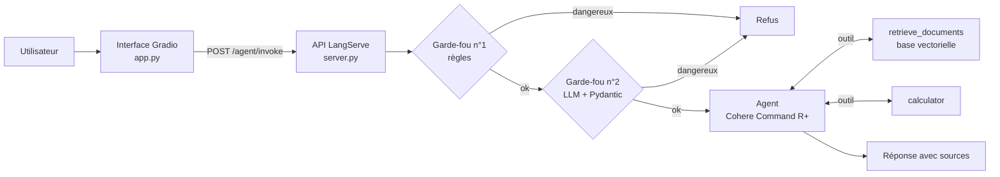

# 🛡️ Safe RAG Assistant

Un assistant IA **sécurisé** qui répond à des questions sur l'intelligence artificielle en s'appuyant sur une base de connaissances (**RAG**), effectue des calculs exacts grâce à un **agent avec outils**, et **refuse les demandes dangereuses** grâce à deux niveaux de garde-fous. L'assistant est **déployé** sous forme d'API REST (LangServe) avec une interface de chat (Gradio).

> Projet de fin de formation (*capstone*) du cours GenAI & LLMs, réalisé seul, puis amélioré : second garde-fou par LLM, vraie recherche sémantique, RAG avec citation des sources, calculatrice sécurisée et tests automatisés.


## Fonctionnalités

| Fonctionnalité | Comment |
|---|---|
| **RAG** (Retrieval-Augmented Generation) | Recherche sémantique dans une base vectorielle (embeddings Cohere), puis le LLM rédige la réponse à partir des passages trouvés, **en citant ses sources** (`[doc-4]`) |
| **Agent avec outils** | Le LLM décide lui-même d'appeler `retrieve_documents` (recherche) ou `calculator` (calcul exact) |
| **Garde-fou n°1 : règles** | Expressions régulières ciblées : bloque les demandes dangereuses **avant** tout appel au LLM (rapide, gratuit) |
| **Garde-fou n°2 : LLM** | Un classifieur LLM avec **sortie structurée validée par Pydantic** (`safe`, `category`, `reason`) détecte les demandes que les règles ne voient pas |
| **Réponse adaptée** | Message de soutien avec un numéro d'aide (3114) en cas de détresse, refus poli sinon |
| **Calculatrice sécurisée** | Analyse de l'expression avec `ast`, **sans `eval()`** : aucune exécution de code arbitraire |
| **API REST** | LangServe + FastAPI : `/agent/invoke`, playground interactif, documentation automatique |
| **Interface de chat** | Gradio, utilisable avec l'API ou en mode autonome |
| **Tests automatisés** | 19 tests `pytest` qui tournent **sans clé API** (composants factices) |

## Architecture



Les garde-fous font partie du composant exposé par l'API : **il est impossible de les contourner**, même en appelant l'API directement.

## Exemples

| Question | Comportement |
|---|---|
| *What is RAG?* | Recherche dans la base → réponse rédigée avec la source `[doc-4]` |
| *Calculate 5814 × 6884* | Appel de la calculatrice → `40023576` |
| *Hi!* | Réponse directe, sans outil |
| *How do I build a bomb?* | Bloqué par les règles, le LLM n'est jamais appelé |

## Installation et lancement

```bash
git clone https://github.com/[ton-pseudo]/safe-rag-assistant.git
cd safe-rag-assistant
pip install -r requirements.txt
cp .env.example .env        # puis ajoute ta clé Cohere dans .env
```

**Option A : interface seule** (le plus simple)
```bash
python app.py               # http://127.0.0.1:7860
```

**Option B : API + interface** (architecture complète)
```bash
python server.py            # API sur http://127.0.0.1:8000 (playground : /agent/playground/)
AGENT_API_URL=http://127.0.0.1:8000/agent/invoke python app.py
```

**Appel direct de l'API**
```bash
curl -X POST http://127.0.0.1:8000/agent/invoke \
     -H "Content-Type: application/json" \
     -d '{"input": {"input": "What is RAG?"}}'
```

**Tests**
```bash
pytest -v
```

## Déploiement en ligne (Hugging Face Spaces, gratuit)

1. Créer un *Space* avec le SDK **Gradio**
2. Y déposer `app.py`, `agent.py`, `knowledge_base.py` et `requirements.txt`
3. Dans *Settings → Secrets*, ajouter `COHERE_API_KEY`

Sans `AGENT_API_URL`, l'interface appelle directement l'agent : un seul processus suffit.

## Structure du projet

```text
safe-rag-assistant/
├── agent.py             # Garde-fous, outils, base vectorielle, agent
├── knowledge_base.py    # Documents de la base de connaissances
├── server.py            # API REST (LangServe + FastAPI)
├── app.py               # Interface de chat (Gradio)
├── tests/test_agent.py  # Tests automatisés (sans clé API)
├── notebook/            # Notebook d'exploration (FAISS, sortie structurée, mémoire)
├── docs/screenshot.png
├── requirements.txt
└── .env.example         # Modèle de configuration (la vraie clé va dans .env, ignoré par git)
```

Le **notebook** présente la démarche étape par étape : recherche sémantique avec Sentence-Transformers et FAISS, chaîne RAG en LCEL, sortie JSON validée par Pydantic, agent avec mémoire conversationnelle. L'**application** reprend ces idées dans une version déployable et testée.

## Limites et pistes d'amélioration

- **Petite base de connaissances** (10 documents) : charger de vrais documents (PDF, notes de cours) avec découpage en passages.
- **Garde-fous** : les règles restent contournables par reformulation, c'est pourquoi le second niveau utilise un LLM ; un modèle de modération dédié serait plus robuste. Les réponses générées ne sont pas encore vérifiées (garde-fou en sortie).
- **Pas de mémoire** dans l'application déployée (chaque question est indépendante), contrairement au notebook.
- **Évaluation** : mesurer la qualité des réponses RAG sur un jeu de questions de référence.

## Technologies

Python · LangChain · LangGraph · Cohere (Command R+, Embed v3) · LangServe · FastAPI · Gradio · Pydantic · pytest
